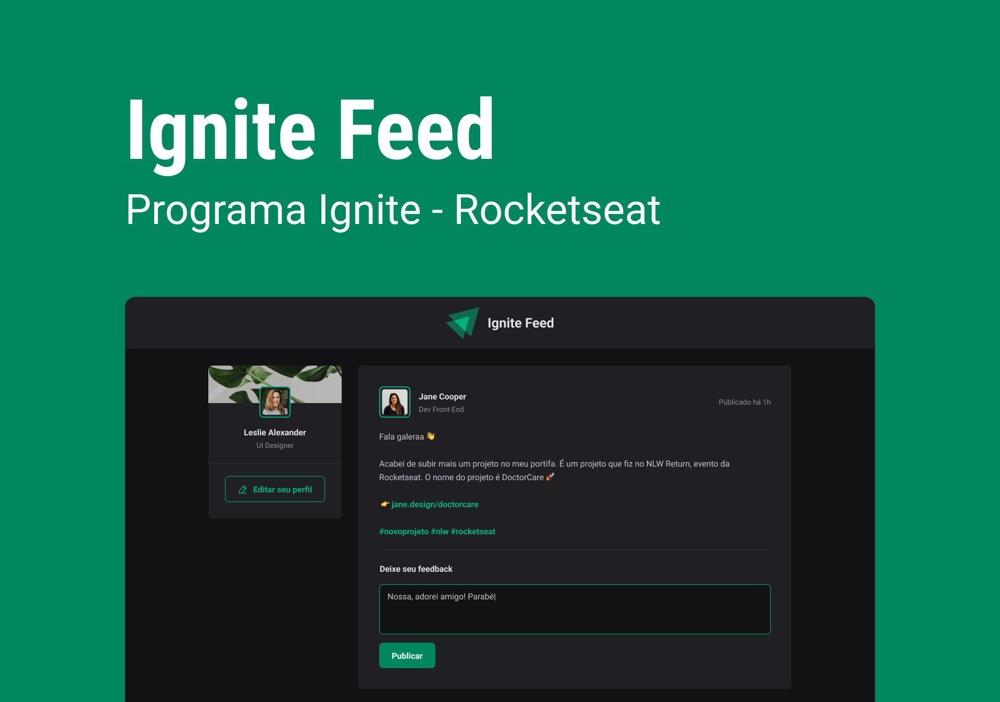

  
  <h3>Formação em React - Cursando</h3>

## Descrição
Formação React: Desenvolva interfaces modernas e reativas na web utilizando uma biblioteca modular e escalável. Disponível na [Rocketseat](https://www,rocketseat.com.br).

Todos os materiais aprendidos em aula, assim como todos desafios técnicos desenvolvidos e entregues estão específicados nesse readme.

## Índice

- [Fundamentos](#fundamentos)
- [Aprofundando em Hooks](#aprofundando-em-hooks)
- [HTTP e Performance](#http-e-performance)
- [Integrando Frontend - Backend](#integrando-frontend---backend)
- [Primeiro framework](#primeiro-framework)
- [Design System](#design-system)
- [Aprofundando em Next.js](#aprofundando-em-nextjs)
- [Certificado final](#certificado-final)

## Fundamentos

#### Conteúdo
- Fundamentos do React (Projeto, Componentes, Propriedades)
- CSS Global vs CSS Modules
- Iterações (loop e key)
- Estado (useState)
- Comunicação entre componentes
- Formulário
- Fundamentos e aplicação do TypeScript
- Figma: [Download](01-fundamentos/figma/Ignite_Feed.fig)

### Projeto - Ignite Feed

### Desafio

## Aprofundando em Hooks

## HTTP e Performance

## Integrando Frontend - Backend

## Primeiro framework

## Design System

## Aprofundando em Next.js

## Certificado final
